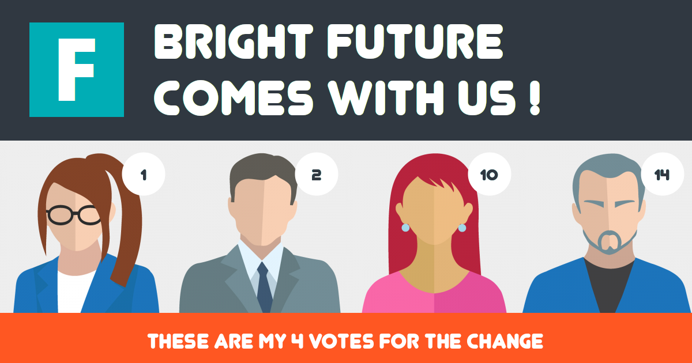

# Candidator

Web service for generating images with selected candidates and their numbers.

## Use case

I am competition organizer or political party and I want to let people to choose their favorite candidates. The result of the choice will be an image which can be shared on social media.

## How it looks



## How to run

There is an example in repository which can be directly served via

    php -S localhost:8000

Then open following url in your browser

    http://localhost:8000/example.php?nrs=1-2-10-14

Where you can modify `nrs` parameter to contain from **one** to **four** numbers delimited by `-`. Maximum number in example is **18**.

>You need to have installed [PHP](https://www.php.net/) and enabled [extension=gd](https://www.php.net/manual/en/book.image.php).

## How to run with docker

If you do not have PHP installed you can build and run docker image

    docker build -t candidator .
    docker run -i -p 8000:80 candidator

## How to include in your code

In the simplest case you can serve candidator with following code

```php
<?php
    require 'candidator.php';
    (new Candidator())->serve();
?>
```

>Beside `candidator.php` you need folders `lib` and `assets`.

If you would like to change some configuration use code similar to following

```php
<?php
    require 'candidator.php';
    
    // Create
    $gen = new Candidator();

    // Configure
    $gen->out_path = '/tmp/candidator/render';
    $gen->images_root = './assets/candidates';
    $gen->no_img_path_male = './assets/silhouette-male.png';
    $gen->no_img_path_female = './assets/silhouette-female.png';
    $gen->c_data_path = './assets/candidates.json';

    // Serve
    $gen->serve();
?>
```

If you would like to just generate image you can use code similar to following

```php
<?php
    require 'candidator.php';

    // Create
    $gen = new Candidator();

    // Get input numbers
    $numbers = array(1, 2, 10, 14);

    // Generate image
    $image = $gen->generate($numbers);
?>
```

## How to customize

### Candidates

Candidates are by default defined in file `assets/candidates.json`. This file contains JSON array with entry per each candidate. 

Candidate object has following attributes

 - `name` with full name of candidate (not used yet)
 - `number` with candidate number (always required)
 - `img` with path to candidate image (not required but good to have :) )
 - `gender` with `m` for male or `f` for female (required when `img` is not specified)
 
### Background

By default `assets/background.png` file is used as background. You can replace this file or change `background_img_path` configuration attribute.

Background image needs to be PNG or JPEG file !

### No candidate image

If candidate has not specified `img` attribute then based on candidate gender one of silhouette images `assets/silhouette-male.png` or `assets/silhouette-female.png` will be used. You can replace these files for your owns or change `no_img_path_male` and `no_img_path_female` configuration attributes.

Silhouette images needs:
 
  - to be PNG file or JPEG ! 
  - to have same size as candidate images !

### Output path

You can specify path where images will be saved and reused if somebody requests same combination of candidates again. Default path is `/tmp/candidator/render` directory and can be changed with configuration attribute `out_path`.

>When running `example.php` you can force regeneration of images with adding request parameter `force=1`, e.g. `http://localhost:8000/example.php?nrs=1-2-10-14&force=1`.